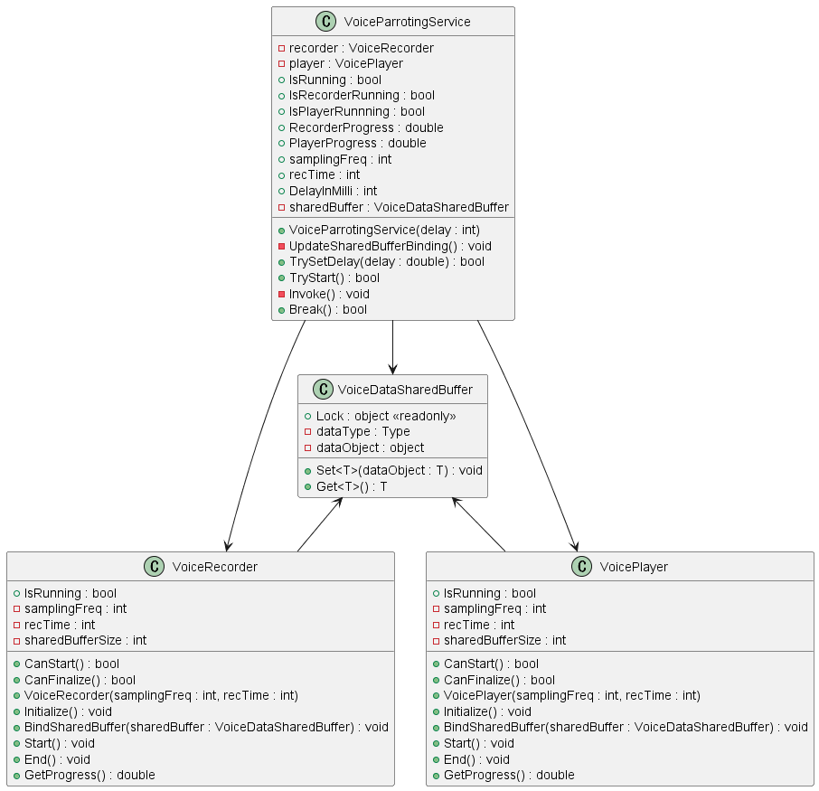
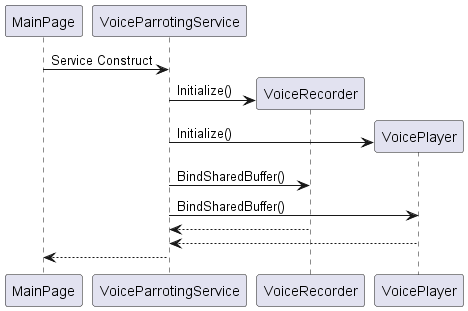

# MauiVoiceParrotingApp

A toy program to parrot voice input with a certain time delay.

## Files edited

Details

 - MauiVoiceParrotingApp/
     - Converters/
         - [BusyStateToIndicatorColorConverter.cs](./MauiVoiceParrotingApp/Converters/BusyStateToIndicatorColorConverter.cs)
     - Platforms/
         - Android/
             - [AndroidManifest.xml](./MauiVoiceParrotingApp/Platforms/Android/AndroidManifest.xml)
             - [VoicePlayer.cs](./MauiVoiceParrotingApp/Platforms/Android/VoicePlayer.cs)
             - [VoiceRecorder.cs](./MauiVoiceParrotingApp/Platforms/Android/VoiceRecorder.cs)
         - Windows/
             - [VoiceParrotingService.cs](./MauiVoiceParrotingApp/Platforms/Windows/VoiceParrotingService.cs)
             - [VoicePlayer.cs](./MauiVoiceParrotingApp/Platforms/Windows/VoicePlayer.cs)
             - [VoiceRecorder.cs](./MauiVoiceParrotingApp/Platforms/Windows/VoiceRecorder.cs)
     - Services/
         - [VoiceDataSharedBuffer.cs](./MauiVoiceParrotingApp/Services/VoiceDataSharedBuffer.cs)
         - [VoiceParrotingService.cs](./MauiVoiceParrotingApp/Services/VoiceParrotingService.cs)
         - [VoicePlayer.cs](./MauiVoiceParrotingApp/Services/VoicePlayer.cs)
         - [VoiceRecorder.cs](./MauiVoiceParrotingApp/Services/VoiceRecorder.cs)
     - ViewModels/
         - [VoiceParrotingServiceStateViewModel.cs](./MauiVoiceParrotingApp/ViewModels/VoiceParrotingServiceStateViewModel.cs)
     - [MainPage.xaml](./MauiVoiceParrotingApp/MainPage.xaml)
     - [MainPage.xaml.cs](./MauiVoiceParrotingApp/MainPage.xaml.cs)

## UML (partial)

Class diagram (partial)

Sequence diagram (Service construction)

Sequence diagram (Press Start button)

Sequence diagram (Press Cancel button)

## What I learnt from this project

- How to use audio devices
- How to request permissions (Android)
- How to use NAudio library (Windows)
- How to lock shared variables to access them correctly
- How to use value converters in binding
- How to get resource dictionary with C# script
